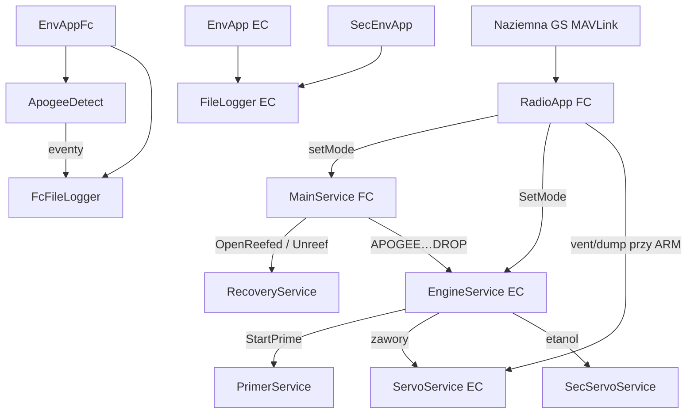

# Aplikacje (`apps`)

Adaptive Applications warstwy lotu. Każda usługa wystawia SOME/IP (IPC na lokalnym CPU + UDP między komputerami). Multicast: `224.224.224.245:30490`.

## TL;DR

Trzy komputery: **EC** (napęd), **FC** (nawigacja + recovery), **SEC_EC** (etanol). Stan rakiety synchronizują Radio → Engine (EC) i Main (FC).

## Komputery

| CPU | IP | Rola |
|-----|-----|------|
| EC | 192.168.10.51 | Zawory utleniacza/PFS, primer, sekwencer silnika |
| FC | 192.168.10.52 | IMU/BME, GPS, radio GS, apogeum, spadochrony |
| SEC_EC | 192.168.10.53 | Zawory etanolu, ciśnienia komory 2/3 |

Na każdym CPU działają też usługi MW: GPIO, I2C, temp, timestamp.

## Mapa interakcji

## SOME/IP — katalog ID

| ID | Usługa | CPU |
|---:|--------|-----|
| 514 | EnvApp | EC |
| 515 | ServoService | EC |
| 516 | PrimerService | EC |
| 517 | FileLoggerApp | EC |
| 518 | EngineService | EC |
| 519 | GPSService | FC |
| 520 | RecoveryService | FC |
| 521 | MainService | FC |
| 522 | SysStatService | EC |
| 523 | FcSysStatService | FC |
| 525 | SecServoService | SEC_EC |
| 526 | SecEnvApp | SEC_EC |
| 529 | EnvAppFc | FC |
| 530 | RadioService | FC |
| 531 | FcFileLoggerApp | FC |
| 545 | FcRadioService | źródła EC radio |
| 555 | ApogeeDetectService | FC |

## EC

- [ServoService](ec/ServoService/README.md)
- [engine_service](ec/engine_service/README.md)
- [env_service](ec/env_service/README.md)
- [logger_service](ec/logger_service/README.md)
- [primer_service](ec/primer_service/README.md)
- [radio_service](ec/radio_service/README.md)
- [system_stat_service](ec/system_stat_service/README.md)

## FC

- [apogee_service](fc/apogee_service/README.md)
- [env_service](fc/env_service/README.md)
- [gps_service](fc/gps_service/README.md)
- [logger_service](fc/logger_service/README.md)
- [main_service](fc/main_service/README.md)
- [radio_service](fc/radio_service/README.md)
- [recovery_service](fc/recovery_service/README.md)
- [system_stat_service](fc/system_stat_service/README.md)

## SEC_EC

- [ServoService](sec_ec/ServoService/README.md)
- [env_service](sec_ec/env_service/README.md)

GPS i Recovery są w drzewie, ale w `deployment/cpu/fc` bywają zakomentowane. Radio EC ma źródła, ale nie jest w pakiecie CPU EC — na FC idzie pełny `RadioApp`.
