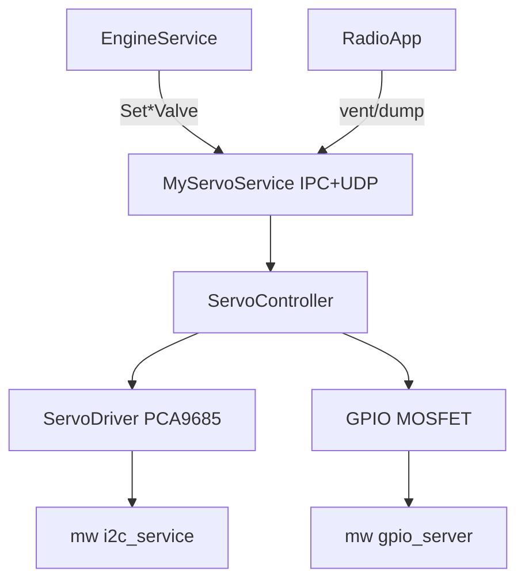
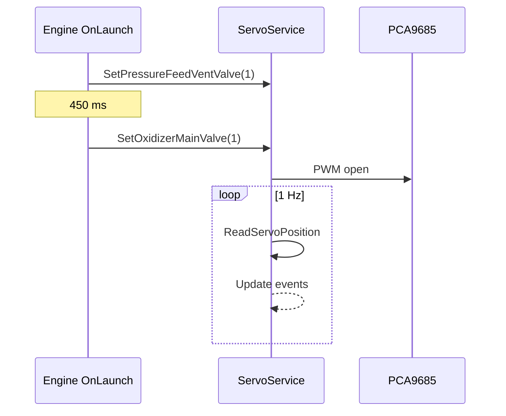

# ServoService (EC)

Sterowanie zaworami utleniacza i Pressure Feed System przez PCA9685 (PWM) + MOSFET-y zasilania.

## TL;DR

SOME/IP `ServoService` (id **515**) otwiera/zamyka 5 zaworów. Pozycje publikuje eventami 1 Hz. Silnik (`engine_service`) i radio (vent/dump przy ARM) są głównymi klientami.

## Opis funkcjonalności

- `ServoController` mapuje stan `0=close`, `1=open`, `2` (tryb specjalny/puls) na impulsy PCA9685.
- Kalibracja open/close z JSON + korekty z EEPROM.
- Wątki: auto-close i pulsing.
- Heartbeat GPIO pin **4**.
- MOSFET-y zasilania serw steruje engine przy ARM/DISARM.

### Zawory

| ID | Zawór | Metoda | Event |
|---:|-------|--------|-------|
| 60 | Oxidizer main | `SetOxidizerMainValve` (1) | `newOxidizerMainValveEvent` (32769) |
| 61 | Oxidizer vent | `SetOxidizerVentValve` (3) | `newOxidizerVentValveEvent` (32770) |
| 62 | Oxidizer dump | `SetOxidizerDumpValve` (5) | `newOxidizerDumpValveEvent` (32771) |
| 63 | PFS main | `SetPressureFeedMainValve` (7) | `newPressureFeedMainValveEvent` (32772) |
| 64 | PFS vent | `SetPressureFeedVentValve` (9) | `newPressureFeedVentValveEvent` (32773) |

Wejście metody: `uint8` (0/1/2) → `bool`. Event: aktualna pozycja `uint8`.

## Architektura

## API SOME/IP

- **Service:** `srp.apps.ServoService`
- **service_id:** 515, v1.0
- Metody i eventy: tabela powyżej.
- Oferty: IPC + UDP (jak inne app).

## Diagnostyka UDS

| DID | sub_service | Rola |
|-----|-------------|------|
| MainServoStatus | 10 | status main |
| Vent | 11 | status vent |
| Dump | 18 | status dump |
| ServoDid | 21 | zapis kalibracji `[id][open_hi][open_lo][close_hi][close_lo]` |

## Konfiguracja

`deployment/apps/servo_service/config.json`, `app_config.json`.

## Zależności

`mw/gpio_server`, `mw/i2c` (PCA9685, EEPROM), `ServoController` współdzielony z SEC_EC i recovery.

## BUILD

- `//apps/ec/ServoService:ServoService`
- Deploy: `//deployment/apps/servo_service:servoService`
