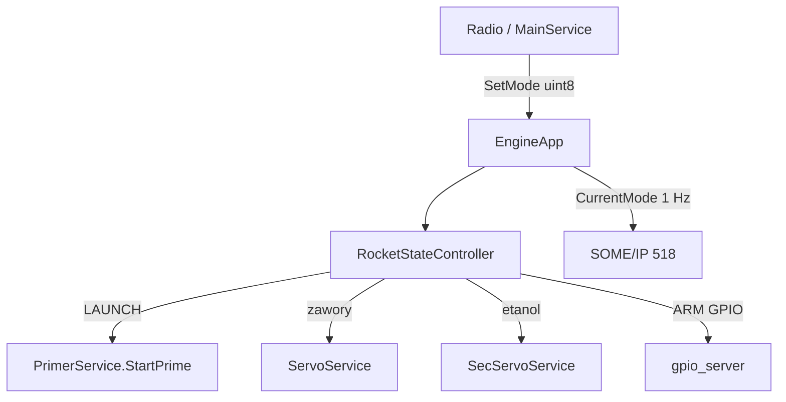
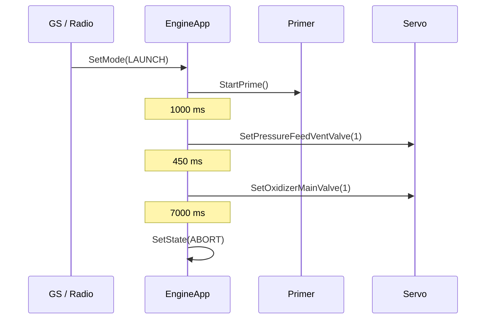

# engine_service (EC)

Główny sekwencer napędu na Engine Computer.

## TL;DR

Właściciel maszyny stanów na EC. SOME/IP `EngineService` (id **518**) przyjmuje `SetMode` (z radia / MainService) i wykonuje ARM, LAUNCH (primer + zawory), APOGEE (dump/vent) i ABORT (blowdown).

## Opis funkcjonalności

Po starcie czeka 5 s, ładuje `arm_pins` z JSON, znajduje Primer/Servo/SecServo/Main/Logger, przechodzi w `DISARM`.

Publikuje `CurrentMode` co 1 s i na zmianie stanu. Heartbeat GPIO pin **1**.

### Akcje stanów

| Stan | Działanie |
|------|-----------|
| **ARM** | GPIO zasilania actuatorów HIGH (MS, VS, PFMS, PFVS, DS, IP) |
| **DISARM / CONNECTION_LOST** | piny LOW; zamknięcie vent + dump |
| **LAUNCH** | wątek: `StartPrime` → 1 s → PFS vent open → 450 ms → oxi main open → 7 s → **ABORT** |
| **APOGEE** | dump + vent open; VS/PFVS/MS zostają HIGH 3.5 s (force), reszta OFF |
| **ABORT** | close main → close PFS vent → close PFS main → 5 s → reopen main + PFS vent (zrzut) |

Wymaganie ARM: muszą istnieć handlery Primer i Servo.

## Architektura

## API SOME/IP

**Service:** `srp.apps.EngineService`, **id 518**

| Rodzaj | Nazwa | ID | Typ |
|--------|-------|---:|-----|
| Method | `SetMode` | 2 | `uint8` → `bool` |
| Event | `CurrentMode` | 32769 | `uint8` (`RocketState_t`) |

## Konfiguracja

`etc/config.json` — tablica `arm_pins`: `{id, desc, func}`. W deployment: pin 9=PFVS, 5=MS, 6=VS, 7=PFMS, 14=DS, 8=IP.

## Zależności

`RocketStateController`, GPIO MW, proxy: Primer, Servo, SecServo, MainService, FileLogger.

## BUILD

- `//apps/ec/engine_service:engine_service`
- Deploy: `//deployment/apps/engine_app:EngineService`
