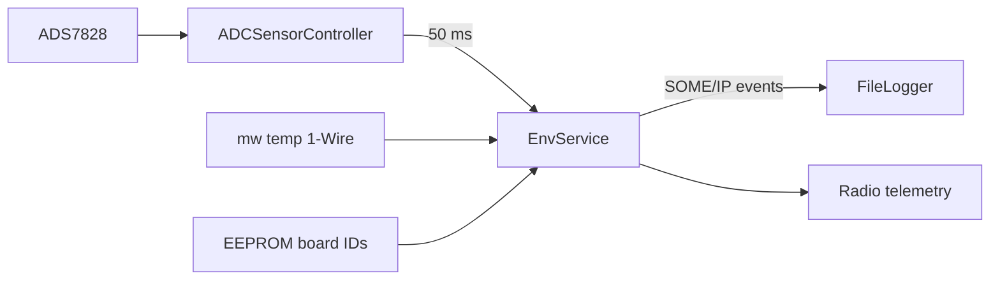

# env_service (EC)

Telemetria środowiskowa napędu: ciśnienia zbiorników/komory i temperatury 1-Wire.

## TL;DR

SOME/IP `EnvApp` (id **514**) — tylko eventy. ADC ADS7828 co 50 ms (ciśnienie ×100 jako `int16`), trzy temp zbiorników + trzy temp płytki z EEPROM.

## Opis funkcjonalności

- Ciśnienia: sensor_id **10** utleniacz, **11** PFS, **12** komora 1 → eventy 32772–32774.
- Temperatury zbiorników: eventy `newTempEvent_1/2/3` (32769–32771), `int16` (°C × 10).
- Temperatury płytki: `newBoardTempEvent1/2/3` (32775–32777) — ID 1-Wire z EEPROM.
- Subskrypcja `temp_service` z `service_id = 514`.
- Brak metod SOME/IP.

Różnica vs FC: tutaj ciśnienia paliwowe, nie BME/IMU. Vs SEC_EC: tutaj oxi/PFS/komora1, tam etanol i komory 2/3.

## Architektura

## API SOME/IP

**Service:** `srp.env.EnvApp`, **id 514**

| Event | ID | Payload |
|-------|---:|---------|
| newTempEvent_1/2/3 | 32769–32771 | int16 |
| newOxidizerPressEvent | 32772 | int16 (bar × 100) |
| newPressureFeedPressEvent | 32773 | int16 |
| newChamberPressEvent1 | 32774 | int16 |
| newBoardTempEvent1/2/3 | 32775–32777 | int16 |

## Konfiguracja

`deployment/apps/env_service/config.json` (mapowanie ADC `a`/`b` per sensor).

## Zależności

`mw/temp`, `mw/i2c` (ADS7828, ADCSensorController, EEPROM ConfigManager).

## BUILD

- `//apps/ec/env_service:env_service`
