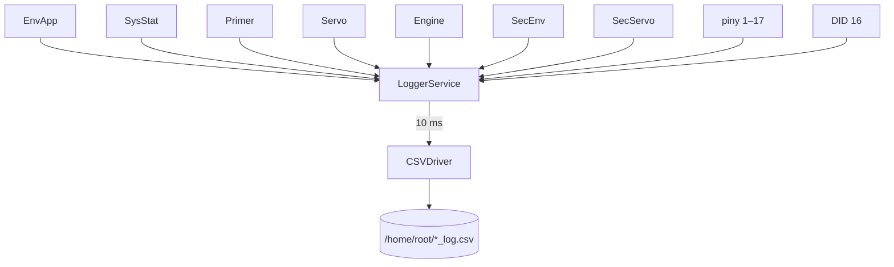

# logger_service (EC)

Pokładowy rejestrator CSV lotu na Engine Computer.

## TL;DR

`FileLoggerApp` (id **517**): `Start`/`Stop` oraz event `LoggingState`. Po starcie zapisuje co **10 ms** do `/home/root/<timestamp>_log.csv` dane z Env, SysStat, Primer, Servo, Engine, **SecEnv**, **SecServo** i GPIO 1–17.

## Opis funkcjonalności

- Subskrypcja eventów SOME/IP (IPC/UDP) i pinów GPIO.
- Znacznik czasu z `TimestampController` (SHM).
- DID 16: zapis 0/1 = stop/start.
- FC ma osobny logger (`FcFileLoggerApp`) z IMU/BME/GPS — ten plik loguje napęd i zawory.

## Architektura

## API SOME/IP

**Service:** `srp.apps.FileLoggerApp`, **id 517**

| Rodzaj | Nazwa | ID | Typ |
|--------|-------|---:|-----|
| Method | `Start` | 1 | void → bool |
| Method | `Stop` | 2 | void → bool |
| Event | `LoggingState` | 32769 | uint8 |

## Diagnostyka

`file_logger_did`, `sub_service_id` **16** — write 0/1 start/stop.

## Zależności

`core/csvdriver`, `core/timestamp`, GPIO controller, proxy wszystkich serwisów EC + SEC_EC.

## BUILD

- `//apps/ec/logger_service/service:logger_service`
