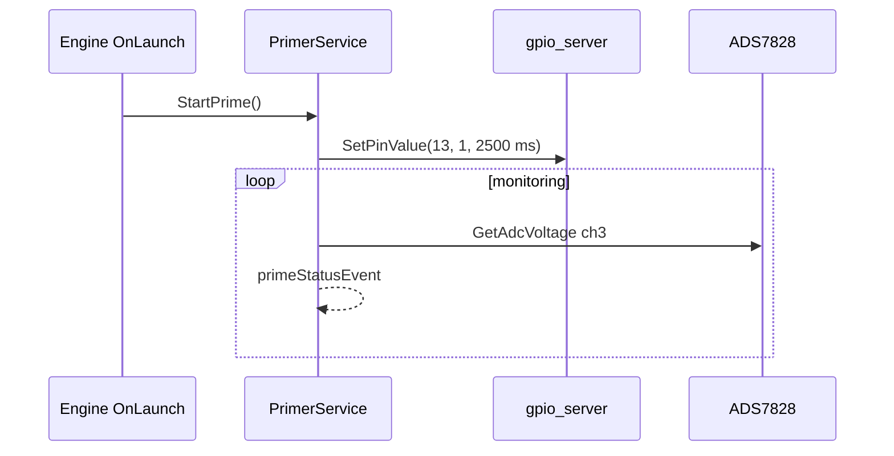

# primer_service (EC)

Zapłonnik / primer — impuls GPIO i diagnostyka ciągłości na ADC.

## TL;DR

`PrimerService` (id **516**): metoda `StartPrime` odpala igniter na pinie 13 na 2500 ms. Event `primeStatusEvent` zgłasza stan złącza (ciągłość ADS7828 ch3, próg 1.5 V). Wołany przez Engine przy LAUNCH.

## Opis funkcjonalności

Stany `PrimerState_t`: `kUNKNOWN`, `kNOT_CONNECTED`, `kCONNECTED`, `kSHORT_CIRCUIT`, `kFIRED`.

- `EnablePrimer(auto_disable=true)` — GPIO 13 HIGH z `active_time=2500`.
- `VerifyPrimerConection` — odczyt ADC kanał 3.
- DID 23: pusty write = fire.

## Architektura

## API SOME/IP

**Service:** `srp.apps.PrimerService`, **id 516**

| Rodzaj | Nazwa | ID | Typ |
|--------|-------|---:|-----|
| Method | `StartPrime` | 3 | void → bool |
| Event | `primeStatusEvent` | 32769 | uint8 |

## Diagnostyka

PrimerDid, `sub_service_id` **23**.

## Zależności

`mw/gpio_server`, `mw/i2c` (ADS7828).

## BUILD

- `//apps/ec/primer_service:primer`
