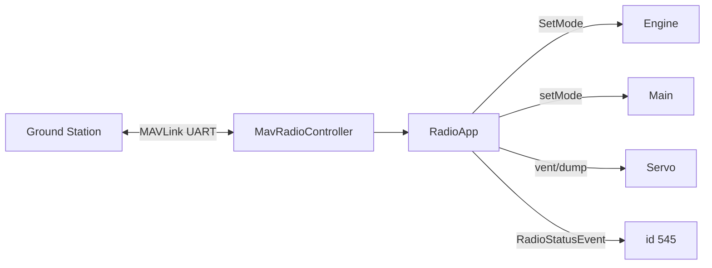

# radio_service (EC)

Most GS ↔ rakieta po MAVLink (UART). Źródła EC; na platformie **w pakiecie FC** leci pełniejszy wariant — ten kod ma zredukowany TX i skeleton `FcRadioService`.

## TL;DR

`FcRadioService` (id **545**) na UART `/dev/ttyS1` @ 57600. RX: heartbeat GS (stan + aktuatory, **4 identyczne ramki**), RADIO_STATUS. TX: HB i max alt co 5 s, GPS co 2 s (tank/computer telem wyłączone). Timeout: 2 min → CONNECTION_LOST, 15 min → ABORT.

## Opis funkcjonalności

- `MavRadioController` — odczyt/zapis MAVLink.
- `SomeIPController` — proxy Engine, Main, Servo.
- `TelemetryProvider` — składanie ramek TX.
- `GSHeartbeatGuard` — watchdog łączności.
- Przy ARM heartbeat GS może sterować vent/dump.
- Heartbeat GPIO pin **2**.

**Uwaga:** `deployment/cpu/ec` obecnie nie pakuje tej aplikacji. Używaj dokumentacji FC radio jako wariantu produkcyjnego na locie.

## Architektura

## API SOME/IP

**Service:** `srp.apps.FcRadioService`, **id 545**

| Event | ID | Payload |
|-------|---:|---------|
| RadioStatusEvent | 32769 | `RadioDataType` |

Brak metod SOME/IP — komendy idą MAVLink → proxy innych usług.

## Timeouty GS

| Czas bez HB | Stan |
|-------------|------|
| 2 min | CONNECTION_LOST |
| 15 min | ABORT |

Oba idą jako `EngineService.SetMode` + `MainService.setMode`.

## Zależności

`core/uart`, `core/onTimerCallback`, GPIO, MAVLink dialect `simba`.

## BUILD

- `//apps/ec/radio_service:radio_service`
