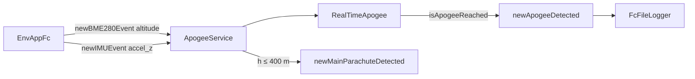
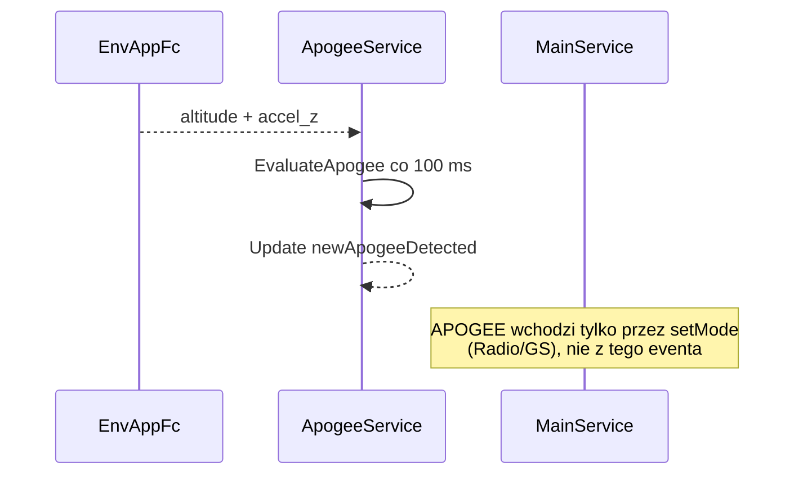

# apogee_service (FC)

Detekcja apogeum i progu głównego spadochronu na podstawie BME + IMU.

## TL;DR

`ApogeeDetectService` (id **555**) subskrybuje `EnvAppFc` (wysokość z BME, `accel_z` z IMU), odpala `RealTimeApogee` co 100 ms. Publikuje `newApogeeDetected` i `newMainParachuteDetected` (wysokość ≤ 400 m). **Nie wywołuje** `MainService.setMode(APOGEE)` — recovery musi dostać APOGEE z GS/radia (albo innego klienta) po FLIGHT.

## Opis funkcjonalności

- Detektor: `RealTimeApogee(15, -0.5, 0.0)`.
- Wysokość: pole `altitude` z eventu BME280.
- Prędkość: obecnie `accel_z` (w kodzie TODO: która oś jest poprawna).
- Po apogeum, gdy `height ≤ 400` m → event głównego spadochronu.

## Architektura

## API SOME/IP

**Service:** `srp.apps.ApogeeDetectService`, **id 555**

| Event | ID | Payload |
|-------|---:|---------|
| newApogeeDetected | 32769 | bool |
| newMainParachuteDetected | 32770 | bool |

Brak metod.

## Zależności

`core/apogee`, proxy `EnvAppFc`.

## BUILD

- `//apps/fc/apogee_service:apogee_service_fc`
