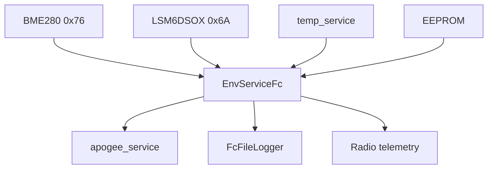

# env_service (FC)

Telemetria nawigacyjna Flight Computer: BME280, IMU LSM6DSOX, temperatury płytki.

## TL;DR

`EnvAppFc` (id **529**) — eventy board temp, BME (T/H/P + wysokość) i IMU ~100 Hz. Brak ciśnień zbiorników (te są na EC/SEC_EC). Główny producent danych dla apogeum, loggera FC i radia.

## Opis funkcjonalności

- 1-Wire board temps z EEPROM → eventy 32769–32771 (`int16`).
- Wątek BME280 → `newBME280Event` (32772, `BME280DataStructure`).
- Wątek LSM6DSOX → `newIMUEvent` (32773, `IMUDataStructure` accel+gyro).
- I2C przez `i2cMWService`.

## Architektura

## API SOME/IP

**Service:** `srp.env.EnvAppFc`, **id 529**

| Event | ID | Payload |
|-------|---:|---------|
| newBoardTempEvent_1/2/3 | 32769–32771 | int16 |
| newBME280Event | 32772 | BME280DataStructure |
| newIMUEvent | 32773 | IMUDataStructure |

## Konfiguracja

`deployment/apps/fc/.../env` — lista `sensors-temp` zwykle pusta; ID płytki z EEPROM.

## Zależności

`mw/temp`, `mw/i2c` (BME280, LSM6DSOX, EEPROM).

## BUILD

- `//apps/fc/env_service:env_service_fc`
