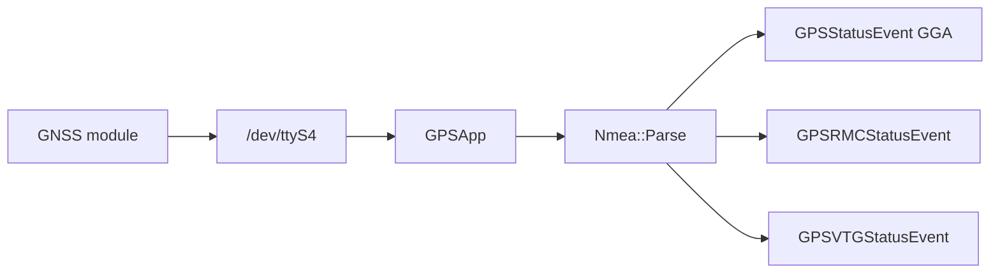

# gps_service (FC)

Odczyt GNSS z UART i publikacja zdań NMEA jako eventy SOME/IP.

## TL;DR

`GPSService` (id **519**): `/dev/ttyS4` @ 230400 → parser `core::Nmea` → eventy GGA / RMC / VTG.

## Opis funkcjonalności

- Ciągły odczyt UART, sklejanie linii NMEA.
- Konwersja do struktur SOME/IP (`GPSDataStructure`, RMC, VTG).
- Ostrzeżenie przy zbyt dużej luce między ramkami.

## Architektura

## API SOME/IP

**Service:** `srp.apps.GPSService`, **id 519**

| Event | ID | Payload |
|-------|---:|---------|
| GPSStatusEvent | 32769 | GPSDataStructure (lat/lon/alt, HDOP, sats) |
| GPSRMCStatusEvent | 32770 | GPSRMCDataStructure |
| GPSVTGStatusEvent | 32771 | GPSVTGDataStructure |

## Zależności

`//core/uart:uart_driver`, `//core/gps:gps_data_parser`, GPIO (opcjonalnie zasilanie).

## BUILD

- `//apps/fc/gps_service:gps_service`
