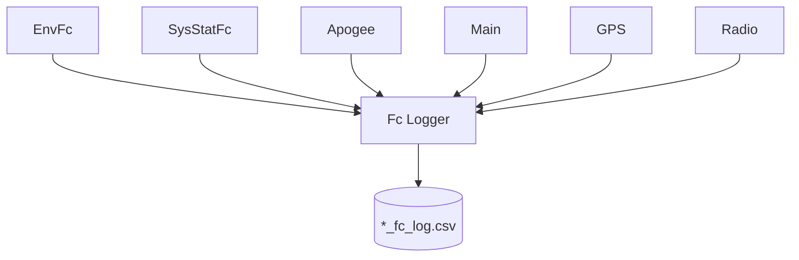

# logger_service (FC)

Rejestrator CSV nawigacji na Flight Computer.

## TL;DR

`FcFileLoggerApp` (id **531**) — to samo API Start/Stop co EC, plik `*_fc_log.csv`. **Auto-start przy Run.** Loguje EnvFc, SysStatFc, Apogee, Main, GPS, Radio (nie zawory/primer).

## Opis funkcjonalności

Identyczny wzorzec co logger EC: subskrypcje SOME/IP, timestamp SHM, zapis okresowy CSV. Różnica w zestawie kolumn (IMU, BME, GPS, radio, apogeum, stan Main).

## Architektura

## API SOME/IP

**Service:** `srp.apps.FcFileLoggerApp`, **id 531**

| Rodzaj | Nazwa | ID | Typ |
|--------|-------|---:|-----|
| Method | `Start` | 1 | void → bool |
| Method | `Stop` | 2 | void → bool |
| Event | `LoggingState` | 32769 | uint8 |

## Zależności

`core/csvdriver`, `core/timestamp`, proxy usług FC.

## BUILD

- `//apps/fc/logger_service/service:logger_service_fc`
