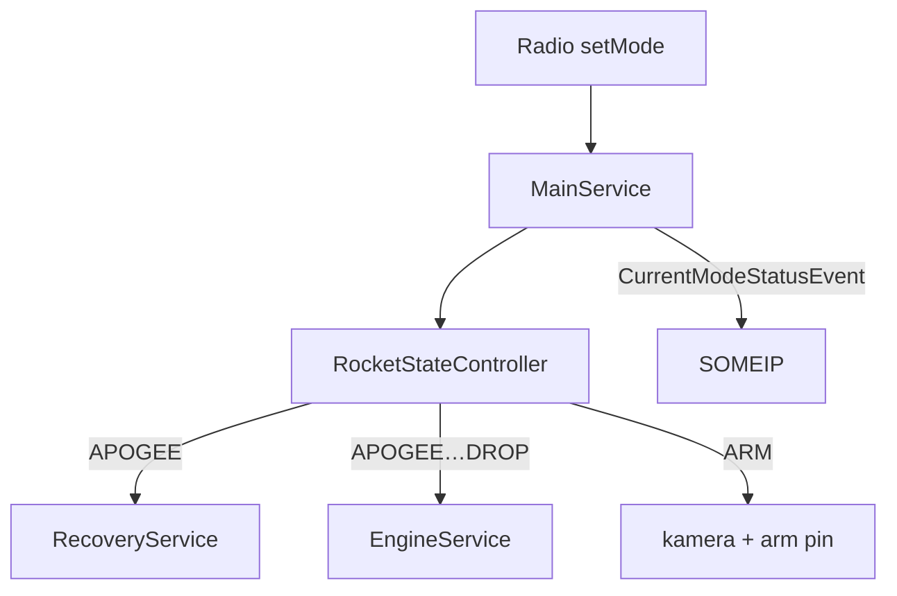
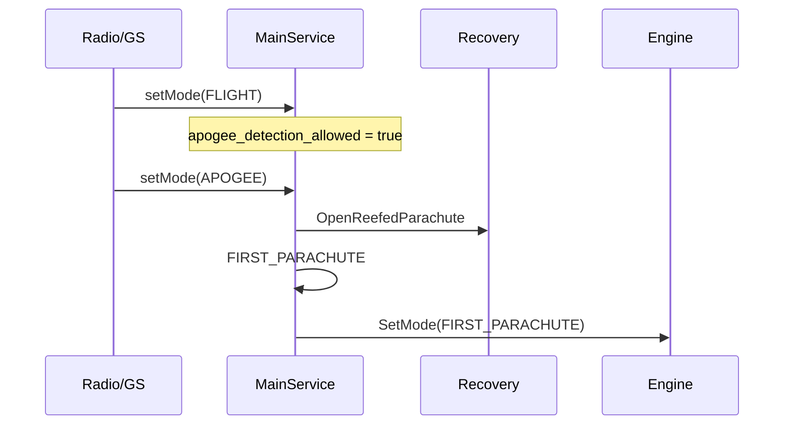

# main_service (FC)

Właściciel maszyny stanów na Flight Computer i orkiestrator recovery.

## TL;DR

`MainService` (id **521**): `setMode` zmienia `RocketStateController`. Przy APOGEE otwiera zrefowany spadochron i synce Engine; przy SECOND_PARACHUTE odrefowuje i przechodzi w DROP. APOGEE jest dozwolone dopiero po FLIGHT (`apogee_detection_allowed`).

## Opis funkcjonalności

| Stan | Akcja FC |
|------|----------|
| ARM | GPIO arm pin 5; zasilanie kamery pin 10 + przycisk pin 9 (500 ms) |
| DISARM / CONNECTION_LOST / ABORT | arm pin OFF |
| LAUNCH | (pusta) |
| FLIGHT | odblokowanie APOGEE |
| APOGEE | `Recovery.OpenReefedParachute` → `FIRST_PARACHUTE` + `Engine.SetMode` |
| SECOND_PARACHUTE | `Recovery.UnreefeParachute` → `DROP` + Engine |
| zmiana na APOGEE / FIRST / SECOND / DROP | dodatkowo `Engine.SetMode` przez UDP |

Heartbeat GPIO pin **1**, event stanu co 1 s.

W `service.json` jest też `NewHBStatus` (32770) poza sekcją `events` — obecnie niepoprawnie zagnieżdżony, nie traktować jako oficjalnego API.

## Architektura

## API SOME/IP

**Service:** `srp.apps.MainService`, **id 521**

| Rodzaj | Nazwa | ID | Typ |
|--------|-------|---:|-----|
| Method | `setMode` | 1 | uint8 → bool |
| Event | `CurrentModeStatusEvent` | 32769 | uint8 |

## Zależności

Recovery (IPC), Engine (UDP), GPIO MW, `rocket_machine_state`.

## BUILD

- `//apps/fc/main_service:MainService`
