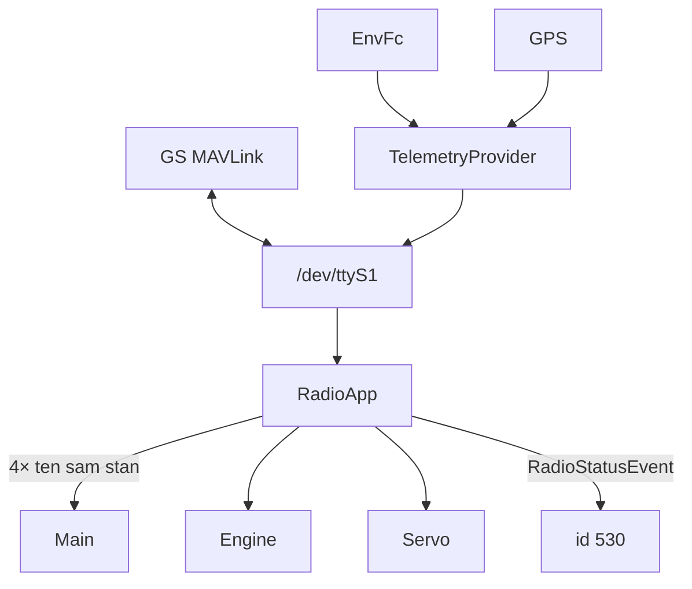

# radio_service (FC)

Łączność z naziemną GS (MAVLink) — wariant produkcyjny w pakiecie CPU FC.

## TL;DR

`RadioService` (id **530**), UART `/dev/ttyS1` @ 57600. Pełny TX: HB ~990 ms, max alt 100 ms, tank / GPS / computer telem 1 s. RX: heartbeat GS (4 potwierdzenia przed zmianą stanu), RADIO_STATUS. Timeout: **5 min** CONNECTION_LOST, **15 min** ABORT → `Main.setMode` + `Engine.SetMode`.

## Opis funkcjonalności

Prawie identyczna architektura jak radio EC (`MavRadioController`, `SomeIPController`, `TelemetryProvider`, `GSHeartbeatGuard`). Różnice:

| | EC | FC |
|--|----|----|
| Skeleton | FcRadioService **545** | RadioService **530** |
| HB TX | 5 s | 990 ms |
| Max alt | 5 s | 100 ms |
| Tank / computer | wyłączone | 1 s |
| GPS TX | 2 s | 1 s |
| Extra | — | `GetDefaultHeartbeat` |
| CONN_LOST | 2 min | 5 min |
| W pakiecie CPU | nie | tak |

Komendy aktuatorów przy ARM (vent/dump) idą do ServoService na EC.

## Architektura

## API SOME/IP

**Service:** `srp.apps.RadioService`, **id 530**

| Event | ID | Payload |
|-------|---:|---------|
| RadioStatusEvent | 32769 | RadioDataType |

## Zależności

UART, timer, GPIO pin 2 (HB), proxy Engine/Main/Servo/Env/GPS.

## BUILD

- `//apps/fc/radio_service:radio_service`
