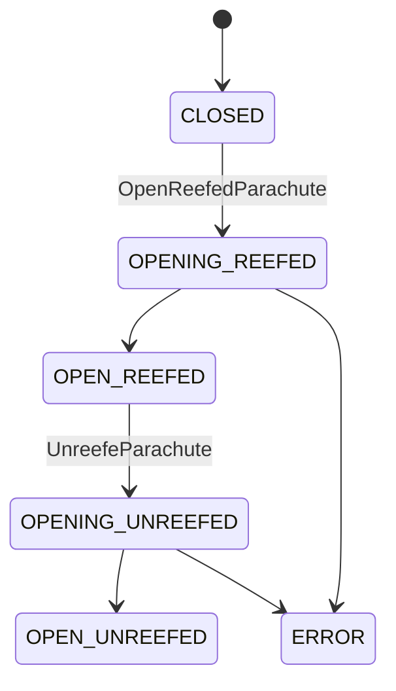
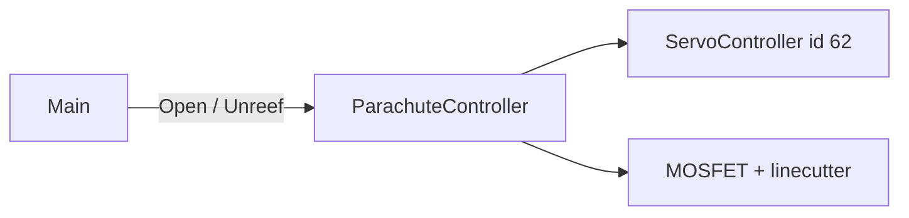

# recovery_service (FC)

Wypuszczenie i odrefowanie spadochronu (MOSFET + serwo + linecutter).

## TL;DR

`RecoveryService` (id **520**): `OpenReefedParachute` i `UnreefeParachute`. Event stanu `NewParachuteStatusEvent`. Wołany przez MainService. W pakiecie FC bywa **zakomentowany**. Ponownie używa `ServoController` z EC (serwo recovery id 62).

## Opis funkcjonalności

Stany `ParachuteState_t`: `CLOSED=1`, `OPENING_REEFED`, `OPEN_REEFED`, `OPENING_UNREEFED`, `OPEN_UNREEFED`, `ERROR`.

- **Open:** sekwencja MOSFET + ruchy serwa (czasy z JSON).
- **Unreef:** impulsy GPIO linecuttera (aktywny / pauza / backup).
- Operacje na `jthread`, mutex przeciw równoległemu otwarciu.

## Architektura

## API SOME/IP

**Service:** `srp.apps.RecoveryService`, **id 520**

| Rodzaj | Nazwa | ID | Typ |
|--------|-------|---:|-----|
| Method | `OpenReefedParachute` | 1 | void → bool |
| Method | `UnreefeParachute` | 2 | void → bool |
| Event | `NewParachuteStatusEvent` | 32769 | uint8 |

## Diagnostyka

RID `sub_service_id` **17**: Start payload `0`=open, `1`=unreef; RequestResults → stan.

## Konfiguracja

JSON: `mosfet_delay`, czasy serwa/linecuttera, piny, `Recovery_servo_id`, liczby powtórzeń sekwencji.

## Zależności

`apps/ec/ServoService/servoController`, `mw/gpio_server`.

## BUILD

- `//apps/fc/recovery_service:RecoveryService`
