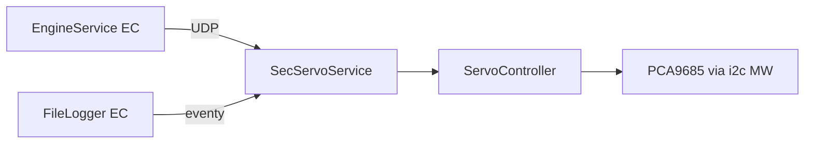

# ServoService (SEC_EC)

Zawory etanolu na drugim komputerze silnika.

## TL;DR

`SecServoService` (id **525**) — tylko dwa zawory: main 63 i vent 64. Ten sam `ServoController` co na EC. Przy `Run` załącza piny zasilania GPIO 9, 5, 6, 7, 14, 8. Brak DID w `app_config`. Logger EC i Engine subskrybują / wołają ten serwis po UDP.

## Opis funkcjonalności

| ID | Zawór | Metoda |
|---:|-------|--------|
| 63 | Ethanol main | `SetEtanolMainValve` (1) |
| 64 | Ethanol vent | `SetEthanolVentValve` (2) |

Eventy 32769 / 32770 (`uint8`). Wartość 0/1/2 jak na EC.

## Architektura

## API SOME/IP

**Service:** `srp.apps.SecServoService`, **id 525** (definicja w `deployment/system_definition/someip/sec_ec/servo_service/`)

| Rodzaj | Nazwa | ID | Typ |
|--------|-------|---:|-----|
| Method | `SetEtanolMainValve` | 1 | uint8 → bool |
| Method | `SetEthanolVentValve` | 2 | uint8 → bool |
| Event | etanol main | 32769 | uint8 |
| Event | etanol vent | 32770 | uint8 |

## Zależności

`apps/ec/ServoService/servoController`, GPIO MW, I2C MW.

## BUILD

- `//apps/sec_ec/ServoService:SecServoService`
