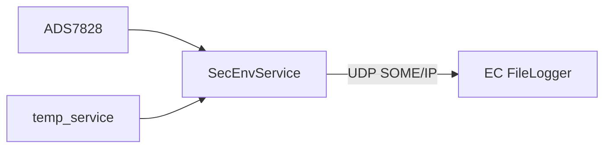

# env_service (SEC_EC)

Czujniki etanolu i dodatkowych komór na Secondary EC.

## TL;DR

`SecEnvApp` (id **526**) publikuje ciśnienie etanolu (sensor 14), komory 2 i 3 (13, 15) co 50 ms oraz temperatury płytki z EEPROM. Konsumuje to **FileLogger na EC** (UDP). Ten sam stack ADC + 1-Wire co env EC.

## Opis funkcjonalności

| Sensor ID | Wielkość | Event ID (typowo) |
|----------:|----------|-------------------|
| 14 | ciśnienie etanolu | 32772 |
| 13 | komora 2 | 32773 |
| 15 | komora 3 | 32774 |
| EEPROM 1-Wire | board temp 1–3 | 32775–32777 |

`TempController` inicjalizowany z `service_id = 514` (wspólny kanał MW temp).

## Architektura

## API SOME/IP

**Service:** `srp.env.SecEnvApp`, **id 526**

Eventy ciśnienia i temperatur analogiczne do EnvApp, inne sensory. Brak metod.

## Konfiguracja

`deployment/apps/sec_ec/env_service/config.json`.

## Zależności

`mw/temp`, `mw/i2c` (ADS7828, ADCSensor, EEPROM).

## BUILD

- `//apps/sec_ec/env_service:SecEnvService`
