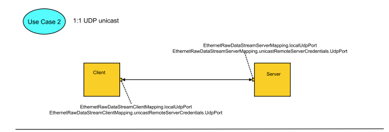
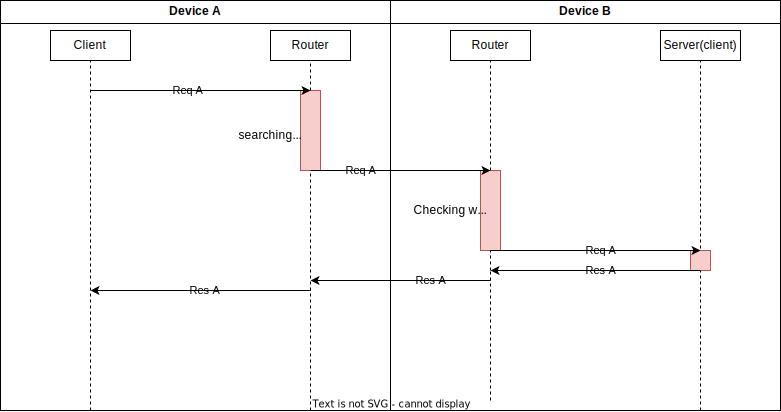
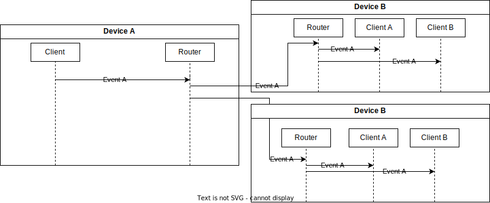

# Komunikacja

# Cele

Celem tego komponentu jest stworzenie własnej implementacji protokołu SOME/IP oraz jego rozszerzenia SOME/IP-SD. Komunikacja ta ma być wykorzystywana do wymiany danych między pojedynczymi procesami wewnątrznie (IPC). Jednak jej głównym celem jest możliwość wymiany informacji między serwisami znajdującymi się na dwóch różnych układach. Wymbranym protokołem jest UDP.

# Globalne ustawienia

## Pula adresów IP

Adres multicast - 224.0.0.10

Adresy urządzeń 192.168.10.2 - 192.168.10.1/24 - 192.168.10.254/24

## Porty

Port odbiorczy dla grupy multicast - 3553

Porty odbiorcze dla pozostały urządzeń: 3554,-3600

# Schematy komunikacji

## This protocol specification specifies the format, message sequences and semantics of the Protocol SOME/IP Service Discovery (*SOME*/*IP*-*SD*). The main tasks of ...Połączenie z znanymi klientami (REQ-RES)

Źródło: <https://www.autosar.org/fileadmin/standards/R22-11/AP/AUTOSAR_SWS_CommunicationManagement.pdf>

## Połączenie z znanymi klientami (EVENT)

# Adresacja serwisów i endpointów

Każdy serwis który będzię korzystał w dowolnej formie z komunikacj tzn. IPC lub UDP musi mieć nadany adres. Adres jest to 16 bitowa liczba przyczym w przyszłości na podstawie tego adresu odbywać się będzie piorytetyzowanie komunikacji.

## Zakresy serwisów:

0x0000 → 0x0003 Zarezerwowane jako adres monitora itp

0x0004 → 0x00FF adresy routerów 

0x0100 → 0x0200 adresy serwisów MW

0x0201 → 0xEFFF adresy serwisów APPs (bez 0xFFFF)

0xFFFF - adres rozgłoszeniowy obecnie nie używany (SOME/IP SD)

## Zakresy endpointów:

0x0000 → 0x7E00 adresy method (REQ→RES / REQ)

0x7F00 → 0x7FFF zarezerwowane na diagnostyke (metody)

0x8000 → 0x80FF , 0x8101→0xFEFF adresy eventów (PUB→SUB)

0xFF00 → 0xFFFF zarezerwowane na diagnostyke (eventy)

0x8100 - adres zarezerwowany do rozgloszeń (SOME/IP SD)