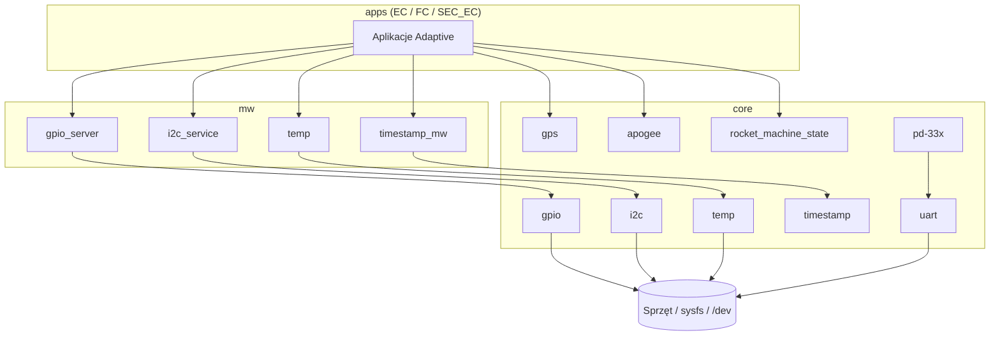

# Core

Warstwa najniższa platformy SRP: sterowniki sprzętowe, parser GPS, filtr Kalmana, maszyna stanów lotu i narzędzia systemowe. Moduły `core` nie wystawiają SOME/IP — są bibliotekami C++ używanymi przez middleware (`mw`) i aplikacje (`apps`).

## TL;DR

`core` izoluje dostęp do GPIO, I2C, UART, 1-Wire, RS485/Modbus oraz dostarcza wspólny czas, logowanie do plików i logikę lotu (apogeum, stany rakiety).

## Architektura

## Moduły

| Moduł | Rola |
|-------|------|
| [common](common/README.md) | `ErrorCode`, CRC-16, endian, kolejka, wait |
| [file](file/README.md) | Odczyt/zapis plików |
| [gpio](gpio/README.md) | Linux sysfs GPIO |
| [i2c](i2c/README.md) | Magistrala I2C (`/dev/i2c-2`) |
| [uart](uart/README.md) | Port szeregowy POSIX |
| [temp](temp/README.md) | Czujniki 1-Wire (DS18B20) |
| [time](time/README.md) | Zmiana czasu systemowego |
| [timestamp](timestamp/README.md) | Wspólna oś czasu (SHM) |
| [gps](gps/README.md) | Parser NMEA |
| [json](json/README.md) | Parser konfiguracji JSON |
| [csvdriver](csvdriver/README.md) | Zapis logów CSV |
| [binary_file_writer](binary_file_writer/README.md) | Zapis binarny |
| [onTimerCallback](onTimerCallback/README.md) | Harmonogram timerów |
| [rocket_machine_state](rocket_machine_state/README.md) | Maszyna stanów lotu |
| [sys](sys/README.md) | CPU / RAM / dysk |
| [pd-33x](pd-33x/README.md) | Ciśnienie Keller PD-33X (Modbus/RS485) |
| [apogee](apogee/README.md) | Kalman + detekcja apogeum |

## Wzorce

- **Symulacja:** GPIO, I2C i temp mają wariant `sim_*` / `SIM_*` z tym samym API (logowanie zamiast HW).
- **Błędy:** `srp::core::ErrorCode`, `std::optional<T>` albo `ara::core::Result<T>`.
- **Logowanie:** `ara::log` z krótkim kontekstem (`gpio`, `i2c-`, `uart`, `temp`, …).

## BUILD

Agregat `//core:core` zawiera tylko `common_converter` i `common_types`. Sterowniki linkuje się osobnymi targetami, np. `//core/gpio:gpio_drivers`.
