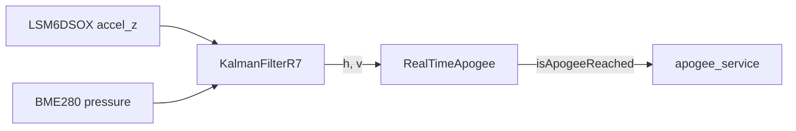
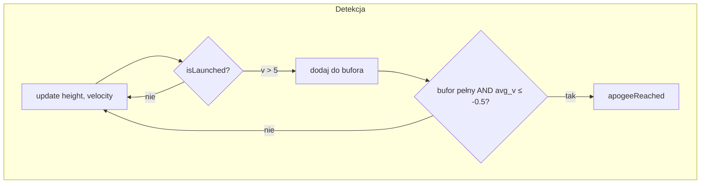

# apogee

Filtr Kalmana (wysokość + prędkość) i detektor apogeum do recovery.

## TL;DR

`KalmanFilterR7` spina przyspieszenie (IMU) z ciśnieniem (BME280 → wysokość ISA). `RealTimeApogee` uznaje apogeum, gdy średnia prędkość pionowa z okna 15 próbek spadnie poniżej −0.5 m/s po starcie (`velocity > 5`).

## Opis funkcjonalności

### Matrix / KalmanFilter

Gęsta macierz float: `+ - *`, transpozycja, `inverse1x1`. Klasyczny filtr: `predict(u)`, `update(z)`.

### KalmanFilterR7

Stan 2D: pozycja (wysokość), prędkość. Wejście sterujące = przyspieszenie. Pomiar = wysokość z ciśnienia (`P0 = 101325` Pa, wzór ISA). `processMeasurement(accel, pressure)` zwraca wektor stanu.

### RealTimeApogee

- Brama startu: `velocity > 5.0`.
- Bufor wysokości i prędkości (`bufferSize`, domyślnie 15).
- Apogeum gdy bufor pełny i `averageSpeed() <= speedThreshold` (domyślnie −0.5).
- `getApogee()` — maksymalna wysokość względna od `startHeight`.

Konsument: `apps/fc/apogee_service` (próg głównego spadochronu 400 m jest w aplikacji, nie tutaj).

## Architektura





## API

```cpp
class KalmanFilter {
  KalmanFilter(F, B, H, Q, R, P, x);
  void predict(const Vector& u);
  void update(const Vector& z);
  Vector getState() const;
};

class KalmanFilterR7 : public KalmanFilter {
  explicit KalmanFilterR7(const float& dt);
  Matrix processMeasurement(float acceleration, float pressure);
};

class RealTimeApogee {
  explicit RealTimeApogee(size_t bufferSize = 15,
                          double speedThreshold = -0.5,
                          double startHeight = 0);
  void update(double height, double velocity);
  bool isApogeeReached() const;
  double getApogee() const;
  double averageSpeed() const;
};
```

## Testy

`CsvReader` / `DataLoader` + dane `@simulation_data_apogee`.

## BUILD

- `//core/apogee:basic_matrix_lib`
- `//core/apogee:KalmanFilter_lib`
- `//core/apogee:apogee_lib`
- `//core/apogee/ut:apogee_detector_tester`
