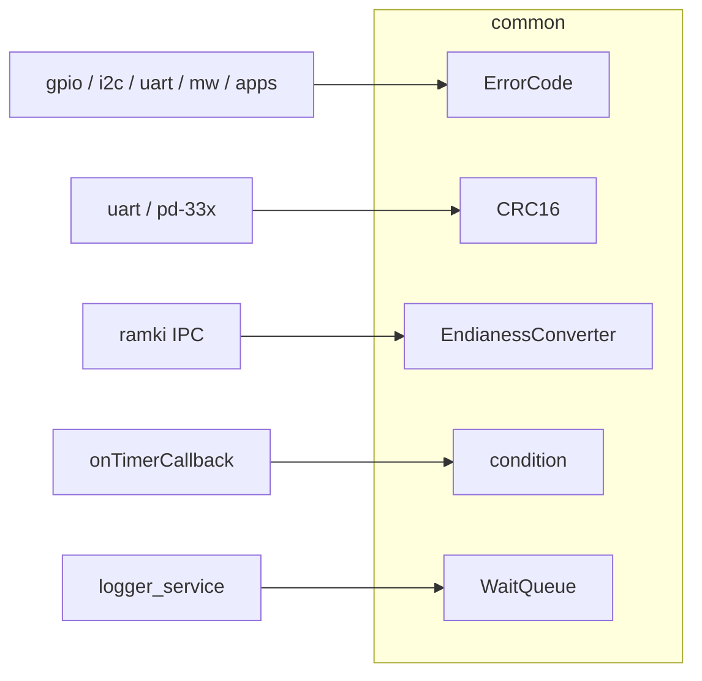

# common

Biblioteka narzędzi współdzielonych przez cały stack SRP.

## TL;DR

Definiuje kody błędów, CRC-16, konwersję endian, kolejkę blokującą i oczekiwanie na `stop_token`. Nie ma sprzętu ani sieci.

## Opis funkcjonalności

- **ErrorCode** — wspólny status operacji (`kOk`, `kError`, `kConnectionError`, `kInitializeError`, `kBadVariableSize`, `kNotDefine`).
- **CRC16** — CRC-16 CCITT-FALSE (init `0xFFFF`, tablica lookup) dla wektorów bajtów i liczb całkowitych.
- **EndianessConverter** — odwracanie kolejności bajtów dowolnego POD (`Convert<T>`).
- **condition** — `wait` / `wait_for` z wybudzeniem na `std::stop_token`.
- **WaitQueue** — kolejka producent–konsument; przy `maxsize != 0` zrzuca najstarszy element przy przepełnieniu.

## Architektura



## API

```cpp
enum ErrorCode { kOk, kNotDefine, kError, kConnectionError, kInitializeError, kBadVariableSize };

class CRC16 {
  static uint16_t calculate(...);  // przeciążenia: int / vector<uint8_t>
};

template<typename T>
T EndianessConverter::Convert(T value);

void condition::wait(std::stop_token);
void condition::wait_for(duration, std::stop_token);

template<typename T, size_t maxsize = 0>
class WaitQueue {
  void Push(T);
  T Get(std::stop_token);           // blokujące
  T GetWithoutRemove(std::stop_token);
  bool IsEmpty();
  void Remove();
};
```

## Zależności

C++20 (`stop_token`), STL. Brak innych modułów `core`.

## BUILD

| Target | Zawartość |
|--------|-----------|
| `//core/common:core` | types + condition + converter + CRC + wait_queue |
| `//core/common:common_types` | `ErrorCode` |
| `//core/common:crc_lib` | CRC-16 |
| `//core/common:common_converter` | endian |
| `//core/common:condition_lib` | wait |
| `//core/common:wait_queue` | kolejka |

Testy: `//core/ut:core_test`, `crc_16`, `wait_queue_test`, `condition_test`.
