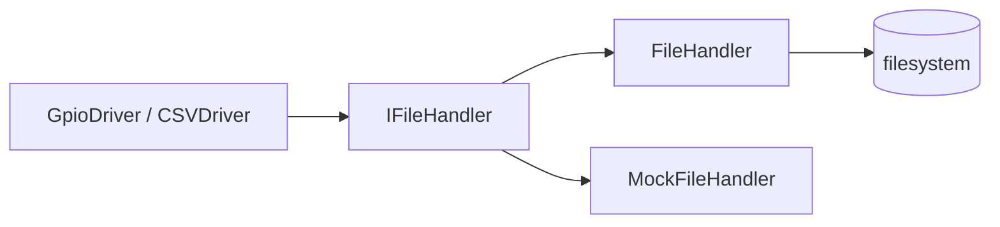

# file

Cienka warstwa nad `std::fstream` do odczytu i zapisu plików tekstowych.

## TL;DR

Abstrakcja `IFileHandler` używana m.in. przez GPIO (sysfs) i CSV. Ułatwia mockowanie I/O w testach.

## Opis funkcjonalności

- Otwarcie pliku w trybie `READ` albo `WRITE`.
- Zapis stringa z opcjonalnym `flush`.
- Odczyt jednej linii (`getline`).
- Ponowne otwarcie zamyka poprzedni deskryptor.

## Architektura



## API

```cpp
enum class FileMode { READ, WRITE };

class IFileHandler {
  virtual bool open(const std::string& path, const FileMode& mode) = 0;
  virtual void close() = 0;
  virtual bool write(const std::string& data, bool flush_after_write = true) = 0;
  virtual std::optional<std::string> read() = 0;  // jedna linia
};

class FileHandler : public IFileHandler;
class MockFileHandler;  // gmock
```

## Zależności

`@srp_platform//ara/log` (kontekst `"file"`).

## BUILD

- `//core/file:file_lib`
- `//core/file:file_interface`
- `//core/file:mock_file` (testonly)
- Test: `//core/file/ut:file_test`
