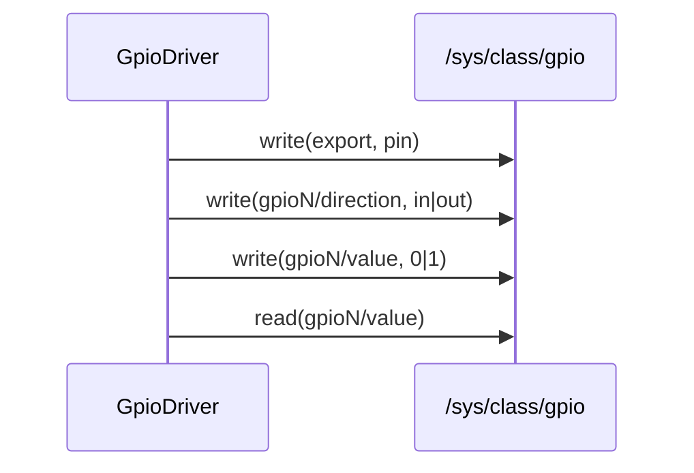
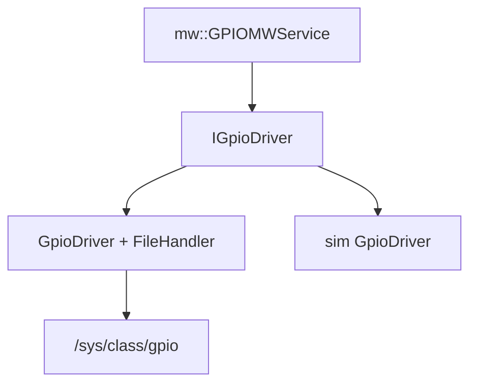

# gpio

Sterownik cyfrowych pinów GPIO przez Linux sysfs (`/sys/class/gpio`).

## TL;DR

Eksportuje pin, ustawia kierunek IN/OUT, czyta i zapisuje wartość. Wariant `sim_gpio_drivers` loguje operacje i nie rusza sprzętu.

## Opis funkcjonalności

- `initializePin` — `export` + ustawienie kierunku.
- `setValue` / `getValue` — `0`/`1` na `gpioN/value`.
- `setDirection` / `getDirection`.
- `unregisterPin` — `unexport`.
- Ścieżki: `/sys/class/gpio/export`, `unexport`, `gpioN/value`, `gpioN/direction`.

Dostęp do plików jest chroniony `std::mutex`. Parametr `use_lock` (domyślnie `true`) pozwala pominąć lock, gdy wywołujący już go trzyma

## Architektura





## API

```cpp
enum direction_t { IN, OUT, ERROR };

class IGpioDriver {
  virtual ErrorCode initializePin(uint16_t pin, direction_t dir, bool use_lock = true) = 0;
  virtual ErrorCode setValue(uint16_t pin, uint8_t value, bool use_lock = true) = 0;
  virtual ErrorCode setDirection(uint16_t pin, direction_t dir, bool use_lock = true) = 0;
  virtual uint8_t getValue(uint16_t pin, bool use_lock = true) = 0;
  virtual direction_t getDirection(uint16_t pin, bool use_lock = true) = 0;
  static std::string getEndpointPath(uint16_t pin, const std::string& endpoint);
  virtual ErrorCode unregisterPin(uint16_t pin, bool use_lock = true) = 0;
};

class GpioDriver : public IGpioDriver {
  explicit GpioDriver(std::unique_ptr<IFileHandler> file);
};
```

## Symulacja

| Target | Zachowanie |
|--------|------------|
| `gpio_drivers` | prawdziwy sysfs |
| `sim_gpio_drivers` | loguje; `getValue` → 1, `getDirection` → IN |

## Zależności

`//core/common:common_types`, `//core/file:file_lib`, `ara/log`.

## BUILD

- `//core/gpio:gpio_interface`
- `//core/gpio:gpio_drivers`
- `//core/gpio:sim_gpio_drivers`
- `//core/gpio/mock:mock_gpio`
- Test: `//core/gpio/ut:gpio_driver_test`
