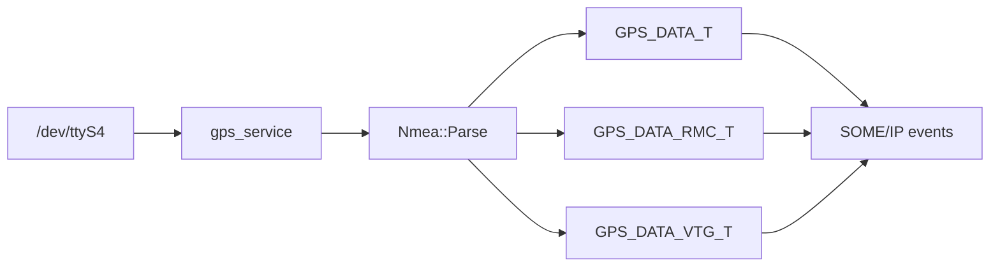

# gps

Parser zdań NMEA GNSS. Nie otwiera UART — surowy strumień dostarcza `apps/fc/gps_service`.

## TL;DR

Parsuje `$GNGGA`, `$GNRMC`, `$GNVTG` do struktur C++. Odrzuca brak fixa (GGA quality `"0"`, RMC `"V"`). Prędkość z węzłów na km/h (× 1.852).

## Opis funkcjonalności

| Zdanie | Struktura | Pola |
|--------|-----------|------|
| GGA | `GPS_DATA_T` | timestamp, lat/lon, liczba satelitów, HDOP, wysokość |
| RMC | `GPS_DATA_RMC_T` | pozycja + prędkość (km/h) + kąt |
| VTG | `GPS_DATA_VTG_T` | kurs względem północy, prędkość względna |

## Architektura



## API

```cpp
class Nmea {
  using NmeaType = std::variant<GPS_DATA_T, GPS_DATA_RMC_T, GPS_DATA_VTG_T>;
  static std::vector<std::string> splitString(const std::string& str, char delimiter = ',');
  static std::optional<NmeaType> Parse(const std::string& gps_data);
};
```

## Zależności

Tylko STL. Brak sprzętu.

## BUILD

- `//core/gps:gps_data_parser`
- Testy: `nmea_test`, benchmarki
