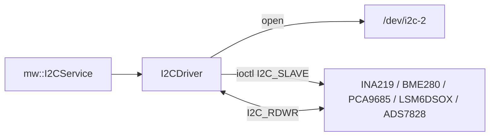

# i2c

Sterownik magistrali I2C w userspace (`/dev/i2c-2`).

## TL;DR

Master I2C: wybór slave (`ioctl I2C_SLAVE`), zapis, odczyt i transakcja połączona `I2C_RDWR`. Aplikacje nie otwierają magistrali same — korzystają z `mw/i2c_service`.

## Opis funkcjonalności

- `Init` — otwarcie `/dev/i2c-2`.
- `Ioctl(address)` — ustawienie adresu slave.
- `Write` — para `[reg, data]` albo pojedynczy bajt.
- `Read` — odczyt N bajtów z bieżącego slave.
- `ReadWrite(reg, size)` — zapis rejestru i odczyt.
- `ReadWrite(write_data, size)` — `I2C_RDWR` (np. BME280, EEPROM).
- `PageWrite` — zapis strony (EEPROM 24LC32AT).

## Architektura



## API

```cpp
class II2CDriver {
  virtual ErrorCode Init() = 0;
  virtual ErrorCode Ioctl(uint8_t address, uint16_t type = I2C_SLAVE) = 0;
  virtual ErrorCode Write(const std::vector<uint8_t>& RegData) = 0;
  virtual ErrorCode Write(const uint8_t& data) = 0;
  virtual std::optional<std::vector<uint8_t>> Read(uint8_t size = 1) = 0;
  virtual ErrorCode PageWrite(std::vector<uint8_t> data) = 0;
  virtual std::optional<std::vector<uint8_t>> ReadWrite(uint8_t reg, uint8_t size = 1) = 0;
  virtual std::optional<std::vector<uint8_t>> ReadWrite(
      const std::vector<uint8_t>& write_data, uint8_t size) = 0;
};

class I2CDriver : public II2CDriver;
```

## Symulacja

`SIMi2cdriver`: Init/Ioctl/Write zwracają `kOk`; Read/ReadWrite → `nullopt`.

## Zależności

Linux `i2c-dev`, `ara/log`, `common_types`.

## BUILD

- `//core/i2c:i2cdriver_base`
- `//core/i2c:i2cdriver`
- `//core/i2c:SIMi2cdriver`
- `//core/i2c/mock:mock_i2c`
