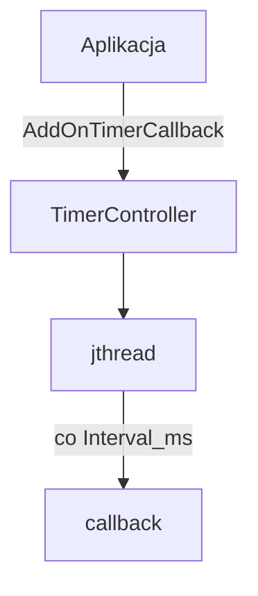

# onTimerCallback

Wielotimerowy scheduler na wątku w tle (`jthread`).

## TL;DR

Rejestruje callbacki z interwałem w ms i wywołuje je okresowo. Sen ograniczony do 1 s, żeby dało się szybko zatrzymać. Catch-up: `last_call` przesuwane o pełny interwał.

## Opis funkcjonalności

- `AddOnTimerCallback(cb, Interval_ms)` — dodanie zadania.
- `Start` / `Stop` — pętla z `condition::wait_for`.
- Callbacki uruchamiane poza lockiem.
- `kMax_sleep_time_ms = 1000`.

## Architektura



## API

```cpp
using OnTimerCallback = std::function<void()>;

struct OnTimerCallback_t {
  const OnTimerCallback callback;
  time_t last_call;
  const uint32_t Interval_ms;
};

class TimerController {
  void AddOnTimerCallback(OnTimerCallback callback, u_int32_t Interval_ms);
  void Start();
  void Stop();
};
```

Klasa niekopiowalna i niemodyfikowalna (non-movable).

## Zależności

`//core/common:condition_lib`, `ara/log` (`"tmr-"`).

## BUILD

- `//core/onTimerCallback:on_timer_callback_lib`
