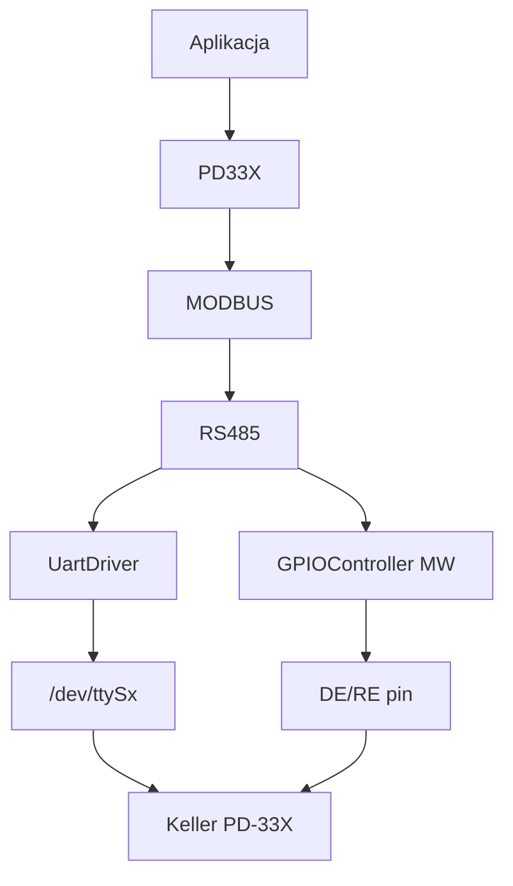
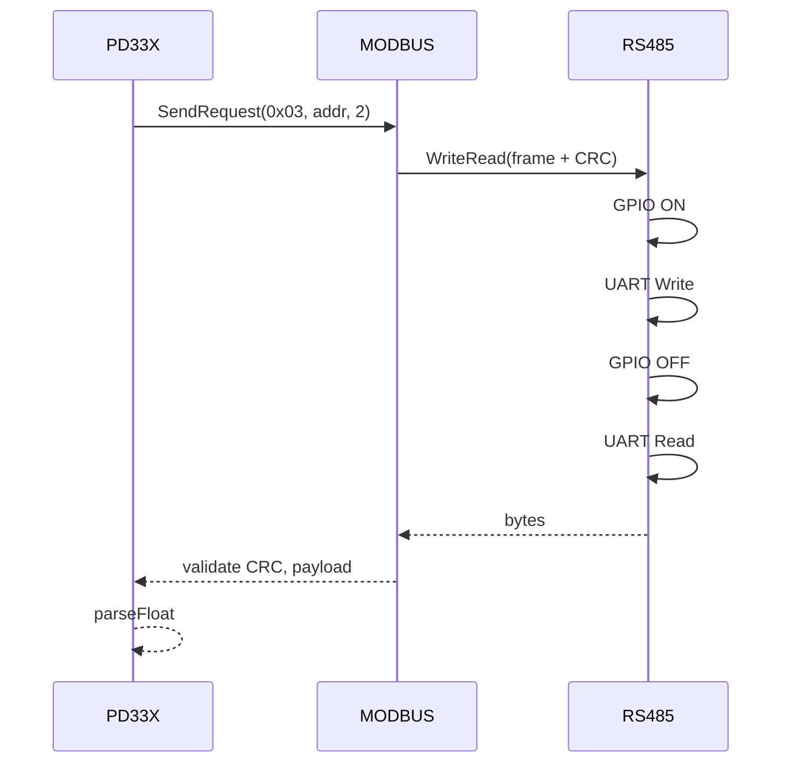

# pd-33x

Sterownik czujnika ciśnienia/temperatury Keller PD-33X (Modbus RTU po RS485).

## TL;DR

Trzy warstwy: half-duplex RS485 (UART + GPIO DE/RE) → ramki Modbus RTU → odczyt P1 i T1 z PD-33X. Aplikacje wołają `PD33X::ReadP1()` / `ReadT1()`.

## Opis funkcjonalności

### RS485

Half-duplex: GPIO HIGH → zapis UART → GPIO LOW → odczyt. Konfiguracja: `pin_id`, `port_name`, `baudrate`.

### Modbus RTU

- `SendRequest(function_code, start_addr, quantity)`.
- CRC-16 Modbus (wielomian `0xA001`).
- Domyślny slave `0x01`.

### PD-33X

- `ReadP1()` — function 0x03, adres 0x02, 2 rejestry (ciśnienie).
- `ReadT1()` — adres 0x08 (temperatura).
- `parseFloat` — kolejność bajtów `[6,5,4,3]` z ramki odpowiedzi.

## Architektura





## API

```cpp
struct RS485_conf_t { uint8_t pin_id; std::string port_name; speed_t baudrate; };

class IRS485 {
  virtual bool Init(const RS485_conf_t&, ...) = 0;
  virtual std::optional<std::vector<uint8_t>> WriteRead(
      const std::vector<uint8_t>&, uint8_t read_size) = 0;
};

class MODBUS {
  bool Init(const RS485_conf_t&, uint8_t slave_id, ...);
  std::optional<std::vector<uint8_t>> SendRequest(
      uint8_t function_code, uint16_t start_addr, uint16_t quantity);
};

class PD33X {
  bool Init(const RS485_conf_t&, uint8_t slave_id = 0x01, ...);
  std::optional<float> ReadP1();
  std::optional<float> ReadT1();
  float parseFloat(const std::vector<uint8_t>& data);
};
```

## Zależności

`//core/uart:uart_driver`, `//mw/gpio_server/controller:gpio_controller`.

## BUILD

- `//core/pd-33x/rs485:rs485_base`, `rs485_driver`, `mock_rs485`
- `//core/pd-33x/modbus:modbus_driver`
- `//core/pd-33x/pd-33x:pd33x_driver`
- Testy: `rs485_test`, `modbus_test`
