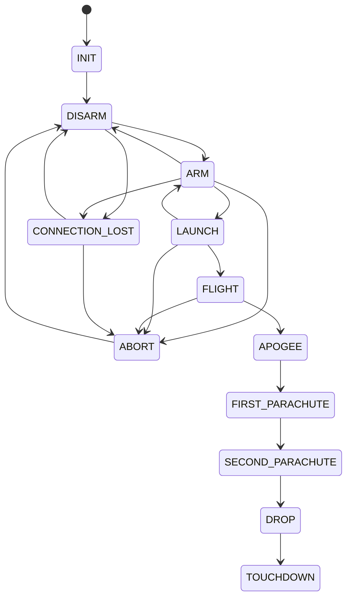

# rocket_machine_state

Singleton maszyny stanów lotu rakiety, wspólny dla GS / EC / FC.

## TL;DR

Waliduje dozwolone przejścia (`INIT → DISARM → ARM → LAUNCH → FLIGHT → APOGEE → … → TOUCHDOWN` plus `ABORT` i `CONNECTION_LOST`). Aplikacje rejestrują callbacki na wejście w stan i wymagania przed zmianą.

Stany do `LAUNCH` steruje GS (przez radio). `FLIGHT` wywołuje EC. Stany od `APOGEE` wzwyż wywołuje FC na obu komputerach.

## Opis funkcjonalności

- `SetState` odrzuca: ten sam stan, niedozwolone przejście, niespełnione `requirements_callback`.
- Po sukcesie: callback stanu, potem `on_change_callback`.
- Wartości `CONNECTION_LOST=54` i `ABORT=64` są celowo poza ciągiem 0–9 (komendy GS).

## Stany

| Wartość | Stan | Znaczenie |
|--------:|------|-----------|
| 0 | INIT | Domyślny po starcie aplikacji |
| 1 | DISARM | Actuatory wyłączone |
| 2 | ARM | Zasilanie actuatorów |
| 3 | LAUNCH | Sekwencja startowa (primer + zawory) |
| 4 | FLIGHT | Lot przed apogeum |
| 5 | APOGEE | Wykryte apogeum |
| 6 | FIRST_PARACHUTE | Spadochron zrefowany |
| 7 | SECOND_PARACHUTE | Odrefowanie |
| 8 | DROP | Opadanie odrefowane |
| 9 | TOUCHDOWN | Na ziemi |
| 54 | CONNECTION_LOST | Brak HB z GS (~2 min) |
| 64 | ABORT | Zrzut paliwa / wyłączenie silnika |

## Architektura



## API

```cpp
class RocketStateController {
  static std::shared_ptr<RocketStateController> GetInstance();
  void RegisterCallback(RocketState_t, StateCallback);
  void RegisterRequirementsCallback(ChangeRequestCallback);
  void RegisterOnStateChangeCallback(OnStateChangeCallback);
  RocketState_t GetState();
  bool SetState(RocketState_t);
};
```

## Kto steruje

| Warstwa | Rola |
|---------|------|
| Radio (GS MAVLink) | `SetMode` na Engine + Main (INIT…LAUNCH, ABORT, CONNECTION_LOST) |
| EngineService (EC) | Wykonuje ARM/LAUNCH/ABORT/APOGEE na sprzęcie napędu |
| MainService (FC) | Recovery, kamera, sync stanów APOGEE…DROP do Engine |

## BUILD

- `//core/rocket_machine_state:rocket_state_base`
