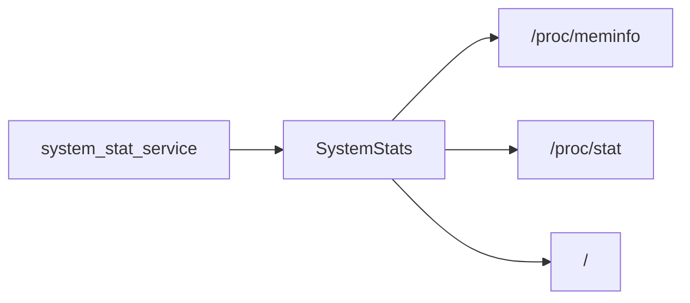

# sys

Statystyki hosta: RAM, CPU, użycie dysku.

## TL;DR

Czyta `/proc/meminfo`, `/proc/stat` i zapełnienie `/`. Używane przez `system_stat_service` (publikacja SOME/IP co 1 s).

## Opis funkcjonalności

- `get_ram_usage()` — procent zajętej RAM.
- `get_cpu_usage()` — procent CPU; w tle wątek sampluje `/proc/stat` co 100 ms (`call_once`). Pierwszy odczyt może zwrócić `nullopt`.
- `get_disk_space()` — procent zajętego rootfs.

## API

```cpp
class SystemStats {
  static std::optional<float> get_ram_usage();
  static std::optional<double> get_cpu_usage();
  static double get_disk_space();
};
```

## Architektura



## BUILD

- `//core/sys:system_status` (`linkopts = ["-lm"]`)
