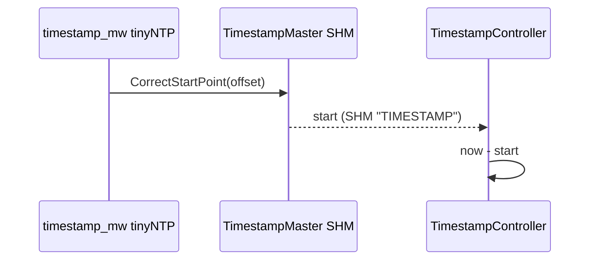
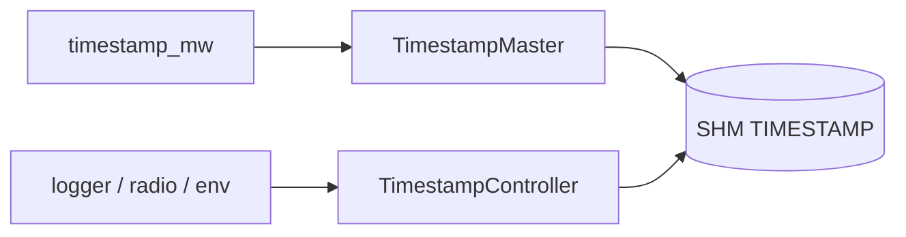

# timestamp

Wspólna oś czasu lotu oparta na shared memory (SHM).

## TL;DR

Master publikuje punkt startu w SHM (`"TIMESTAMP"`). Kontrolery na tej samej płycie liczą czas względny `now - start`. Offset między komputerami koryguje `mw/timestamp_mw` (tinyNTP).

## Opis funkcjonalności

- **TimestampMaster** — oferuje skeleton SHM, `GetNewTimeStamp()` zwraca ms od startu, `CorrectStartPoint(offset)` przesuwa zero (po synchronizacji NTP).
- **TimestampController** — proxy SHM; czeka do 5 s na ofertę mastera; `GetNewTimeStamp()` = aktualny czas − start mastera.
- Zegar: `std::chrono::high_resolution_clock`, milisekundy od epoki.

## Architektura





## API

```cpp
class ITimestampController {
  virtual std::optional<int64_t> GetNewTimeStamp() = 0;
  virtual int64_t GetDeltaTime(int64_t now, int64_t previous) = 0;
  virtual bool Init() = 0;
};

class ITimestampMaster {
  virtual int64_t GetNewTimeStamp() = 0;
  virtual void CorrectStartPoint(int64_t offset) = 0;
  virtual bool Init() = 0;
};

class TimestampController;  // ShmProxy
class TimestampMaster;      // ShmSkeleton
```

Stałe: instance `"TIMESTAMP"`, `kMax_Wait = 5` s.

## Zależności

`bindings/common/shm`, `ara/core:instance_specifier`, `ara/log`, `//core/common:core`.

## BUILD

- `//core/timestamp:timestamp_controller`
- `//core/timestamp:mock_timestamp_controller`
- Test: `//core/timestamp/ut:timestamp_test`
