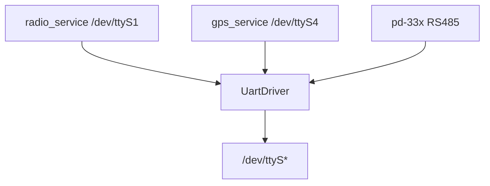

# uart

Sterownik portu szeregowego POSIX (`termios`).

## TL;DR

Otwiera UART (8N1, bez hardware flow control), czyta i zapisuje bajty. Używany przez radio (MAVLink), GPS (NMEA) i warstwę RS485 (PD-33X).

## Opis funkcjonalności

- `Open(port, baudrate, timeout)` — `O_RDWR | O_NOCTTY`, 8N1, `VMIN=0`, `VTIME=10`. Parametr `timeout` jest obecnie ignorowany (VTIME na sztywno).
- `Read(size)` — `size == 0` oznacza odczyt do 256 B.
- `Write` — surowe bajty.
- `Close`.

## Architektura



## API

```cpp
class IUartDriver {
  virtual bool Open(const std::string& portName,
                    uint32_t baudrate = B9600, uint8_t timeout = 10) = 0;
  virtual std::optional<std::vector<uint8_t>> Read(uint16_t size = 0) = 0;
  virtual void Close() = 0;
  virtual ErrorCode Write(const std::vector<uint8_t>& data) = 0;
};

class UartDriver : public IUartDriver;
class MockUartDriver;
```

## Zależności

`//core/common`, `ara/log`, `ara/core:Result`, `ara/com`.

## BUILD

- `//core/uart:Iuart_driver`
- `//core/uart:uart_driver`
- `//core/uart:mock_uart`
- Test: `//core/uart/ut:uart_test`
