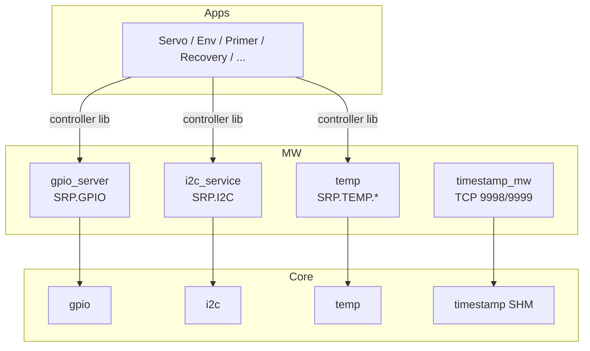

# Middleware (mw)

Warstwa Adaptive Applications między sterownikami `core` a aplikacjami `apps`. **Nie wystawia SOME/IP** — komunikacja to Unix IPC (GPIO / I2C / temp) albo TCP (timestamp / tinyNTP).

## TL;DR

Cztery usługi HW na każdym CPU (EC, FC, SEC_EC): GPIO, I2C, 1-Wire temp, synchronizacja czasu. Aplikacje linkują biblioteki *controller* i wołają MW przez gniazda IPC.

## Architektura

## Usługi

| Usługa | Endpoint | Rola |
|--------|----------|------|
| [gpio_server](gpio_server/README.md) | `SRP.GPIO` | Cyfrowe piny, timer auto-off, subskrypcje |
| [i2c_service](i2c_service/README.md) | `SRP.I2C` | Wyłączny dostęp do magistrali + kontrolery chipów |
| [temp](temp/README.md) | `SRP.TEMP.SERVICE` | 1-Wire, periodyczny push do subskrybentów |
| [timestamp_mw](timestamp_mw/README.md) | TCP 192.168.10.102:9999 | tinyNTP, korekta SHM |

Diagnoza UDS: GPIO DID 12, temp DID 13. I2C ma zdefiniowane DID, ale nie są podpięte do serwisu.
