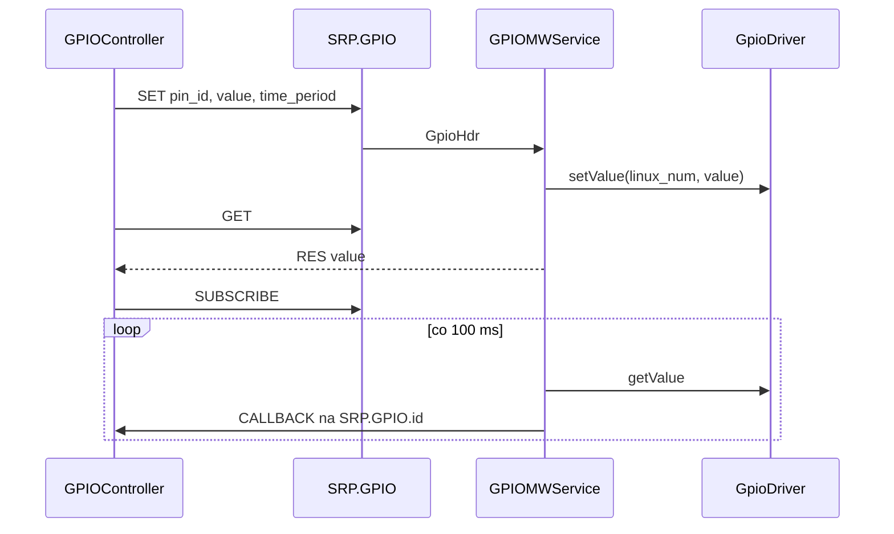
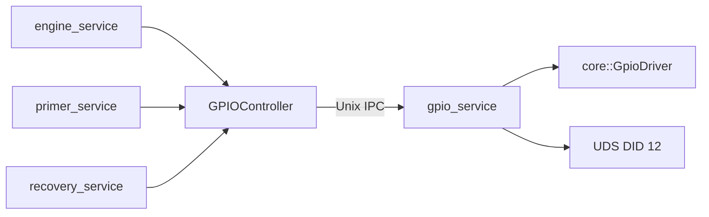

# gpio_server

Middleware GPIO — Adaptive Application serializująca dostęp do pinów cyfrowych.

## TL;DR

Aplikacje wołają `GPIOController` (IPC `SRP.GPIO`). Serwis mapuje logiczne `pin_id` na numery Linux GPIO, obsługuje impuls czasowy (auto-off) i powiadomienia o zmianie stanu. PWM nie jest wspierane — do serw używaj PCA9685 (`i2c_service`).

## Opis funkcjonalności

- **SET** — zapis 0/1. `time_period > 0` → automatyczny powrót do 0 po ms; `time_period == 0` → zostaje; `force_time_period` kasuje tryb „zostań HIGH”.
- **GET** — odczyt aktualnej wartości.
- **SUBSCRIBE / UNSUBSCRIBE** — polling co 100 ms, callback na `SRP.GPIO.<controller_id>`.
- Wątek wygaszania pinów: sen do najbliższego deadline (min. 5 ms).
- Heartbeat pinów w aplikacjach (engine pin 1, servo pin 4) idzie tędy.

## Architektura





## API IPC

**Endpoint:** `SRP.GPIO`  
**Callback:** `SRP.GPIO.<controller_id>`

| ID | Akcja | Kierunek |
|---:|--------|----------|
| 0 | SET | client → service |
| 1 | GET | client → service |
| 2 | RES | service → client |
| 3 | SUBSCRIBE | client → service |
| 4 | UNSUBSCRIBE | client → service |
| 5 | CALLBACK | service → client |

Ramka `GpioHdr`: `action:u8`, `pin_id:u8`, `value:u8`, `time_period:u16`, `force_time_period:bool`.

### Controller (dla aplikacji)

```cpp
core::ErrorCode SetPinValue(uint8_t actuatorID, int8_t value,
                            uint16_t active_time = 0, bool force_time = false);
std::optional<int8_t> GetPinValue(uint8_t actuatorID);
void SetCallback(std::optional<PinChangeCallback>);  // void(uint8_t pin, uint8_t value)
core::ErrorCode ManagePinSubscription(uint8_t pin_id, bool subscribe);
```

## Konfiguracja

`deployment/mw/gpio/config.json` (instalowane jako `etc/config.json`):

```json
{ "gpio": [ { "id": 1, "num": 533, "direction": "out", "desc": "..." } ] }
```

Piny 1–17 (BeagleBone, m.in. LED L0–L3, P8_x).

## Diagnostyka

| Pole | Wartość |
|------|---------|
| DID | `gpio_pin_did` → `/srp/mw/gpio_service/gpio_pin_did` |
| `sub_service_id` | 12 |
| Read 0x22 | 4-bajtowy bitset: bit `pin_id` = poziom |
| Write | 2 B: `[pin_id, 0\|1]`, `pin_id ≤ 60` |

## Zależności

`//core/gpio:gpio_drivers` (lub sim), `//core/file:file_lib`, `StreamIpcSocket`.

## BUILD

| Target | Rodzaj |
|--------|--------|
| `//mw/gpio_server:gpio_service` | binary |
| `//mw/gpio_server:gpio_service_lib` | lib |
| `//mw/gpio_server/controller:gpio_controller` | klient |
| `//deployment/mw/gpio:gpio_service` | adaptive_application |
