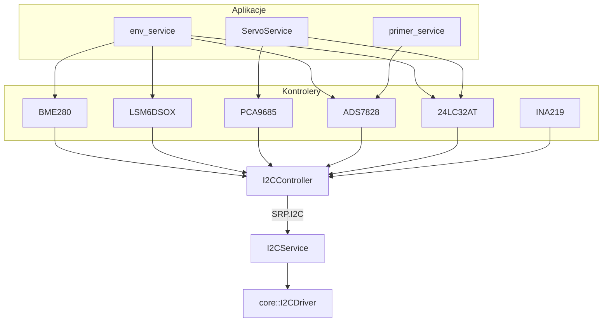

# i2c_service

Middleware magistrali I2C oraz biblioteki kontrolerów konkretnych chipów.

## TL;DR

Serwis `i2cMWService` jest jedynym procesem trzymającym `/dev/i2c-2`. Aplikacje używają `I2CController` (IPC `SRP.I2C`) albo wrapperów: INA219, ADS7828, PCA9685, 24LC32AT, BME280, LSM6DSOX.

## Opis funkcjonalności

Serwis nie zna chipów — tylko surowe akcje pod mutexem:

1. Parse nagłówka 3 B: `action | address | payload_size`.
2. `Ioctl(address)`.
3. Wykonanie Read / Write / PageWrite / WriteRead.
4. Odpowiedź bajtami.

## Architektura



## API IPC

**Endpoint:** `SRP.I2C`

| Akcja | ID | Payload | Zachowanie |
|-------|-----|---------|------------|
| kRead | 0x01 | `{reg, size}` | `ReadWrite(reg, size)` |
| kWrite | 0x02 | bajty | zapis 1 lub N |
| kWriteRead | 0x03 | `{read_size, write_byte}` | 1 B write + N read |
| kRES | 0x04 | — | zarezerwowane |
| kPageWrite | 0x05 | bufor strony | `PageWrite` |
| kWriteReadBuffer | 0x06 | `{read_size, write…}` | `ReadWrite(write, size)` |

### I2CController

```cpp
ErrorCode Init(std::unique_ptr<ISocketStream> socket = ...);
ErrorCode Write(uint8_t address, std::vector<uint8_t> data);
ErrorCode PageWrite(uint8_t address, std::vector<uint8_t> data);
std::optional<std::vector<uint8_t>> Read(uint8_t address, uint8_t reg, uint8_t size = 1);
std::optional<std::vector<uint8_t>> WriteRead(uint8_t address, uint8_t WriteData, uint8_t ReadSize = 1);
std::optional<std::vector<uint8_t>> WriteReadBuffer(uint8_t address,
    const std::vector<uint8_t>& write_data, uint8_t read_size);
```

Brak SOME/IP (`provide: []`).

## Kontrolery chipów

| Chip | Adres | Rola | Kluczowe API |
|------|-------|------|----------------|
| **INA219** | podawany | prąd / napięcie szyny | `GetCurrent`, `GetVoltage` (16 V FSR, shunt 0.01 Ω, max 8 A) |
| **ADS7828** | 0x48 | ADC 12-bit, 8 ch, ref 3.3 V | `GetAdcRawRead`, `GetAdcVoltage` |
| **PCA9685** | 0x70 | PWM 50 Hz (serwomechanizmy) | `SetChannelPosition`, `ReadChannelPosition` |
| **24LC32AT** | 0x50 | EEPROM 4 KB, strony 32 B | `WriteByte/Page/Buffer`, `ReadByte/Sequential` |
| **ConfigManager** | EEPROM @ 0x0000 | 43 B: korekty PCA + 3× ID 1-Wire | `GetConfig` / `SetConfig` |
| **BME280** | 0x76 | T / P / H | `getTemperature/Pressure/Humidity` |
| **LSM6DSOX** | 0x6A | IMU (WHO_AM_I 0x6C) | `ReadGyroData`, `ReadAccelData` |
| **ADCSensorController** | przez ADS7828 | `y = a·V + b` per czujnik | `Init(path)`, `GetValue(sensor_id)` |

## Konfiguracja

Serwis I2C nie ma listy urządzeń. ADCSensor: `etc/config.json` z tablicą `sensors` (`sensor_id`, `channel`, `a`/`b` albo rezystancyjny model `R/RES_MIN/…`).

## Diagnostyka

JSON DID `i2c_Read_did` (30) i `i2c_Write_did` (20) **nie są podpięte** do działającego serwisu.

## BUILD

| Target | Rodzaj |
|--------|--------|
| `//mw/i2c_service:i2cService` | binary |
| `//mw/i2c_service/controller:i2c_controller` | klient |
| `//mw/i2c_service/controller/ina219:ina219_controller` | chip |
| `//mw/i2c_service/controller/ads7828:adc_controller` | chip |
| `//mw/i2c_service/controller/pca9685:pca9685_controller` | chip |
| `//mw/i2c_service/controller/24lc32at:controller` | chip |
| `//mw/i2c_service/controller/bme280:bme280_controller` | chip |
| `//mw/i2c_service/controller/LSM6DSOX:LSM6DSOX_controller` | chip |
| `//deployment/mw/i2c:i2cMWService` | adaptive_application |
