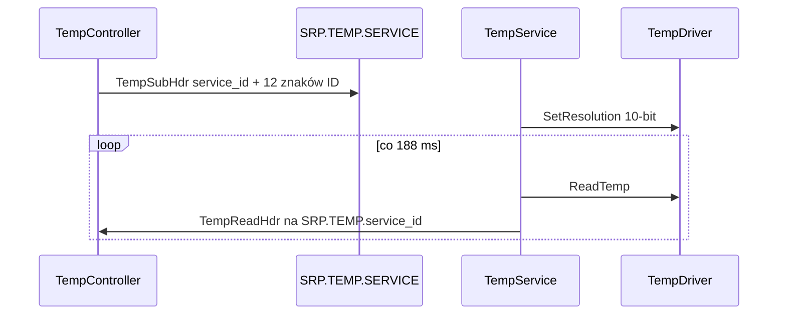

# temp

Middleware czujników 1-Wire (DS18B20).

## TL;DR

Aplikacje subskrybują listę fizycznych ID. Serwis ustawia 10-bit, czyta co 188 ms i pushuje `(sensor_id, float °C)` na `SRP.TEMP.<service_id>`. Wartości są też w DID 13.

## Opis funkcjonalności

1. Bind `SRP.TEMP.SERVICE`, skan czujników, oferta DID.
2. Subscribe: mapowanie `"28-" + 12 znaków` → wewnętrzne `sensor_id` od 1, rozdzielczość 10 bit.
3. Pętla 188 ms (czas konwersji 10-bit): `ReadTemp` async → update DID → `Transmit` do każdego subskrybenta.

Czasy konwersji (`kSensor_resolution`): 9→94 ms, 10→188, 11→375, 12→750.

ID czujników płytki mogą pochodzić z EEPROM (`board_temp{1,2,3}_id`).

## Architektura



## API IPC

| Socket | Rola |
|--------|------|
| `SRP.TEMP.SERVICE` | subskrypcja (stream) |
| `SRP.TEMP.<service_id>` | push odczytów |

**TempSubHdr:** `service_id:u16` + `physical_id_1` … `physical_id_12` (uint8).  
**TempReadHdr:** `actuator_id:u8`, `value:float32`.

### Controller

```cpp
ErrorCode Initialize(uint16_t service_id, TempRXCallback callback,
                     std::unique_ptr<StreamIpcSocket> sock);
std::optional<uint8_t> Register(std::string name);  // 15-znakowe physical id
void StartRxThread();
// TempRXCallback = void(const std::vector<TempReadHdr>&)
```

Aplikacje env używają `service_id` 514 (także SEC_EC).

## Diagnostyka

| Pole | Wartość |
|------|---------|
| DID | `temp_did` → `/srp/mw/temp_service/temp_status_did` |
| `sub_service_id` | 13 |
| Read | pary `(sensor_id:u8, float32 LE)` |
| Write | `kSubFunctionNotSupported` |

## Zależności

`//core/temp:temp_driver` (lub SIM), `StreamIpcSocket` / `IpcSocket`.

## BUILD

| Target | Rodzaj |
|--------|--------|
| `//mw/temp/service:temp_service_mw` | binary |
| `//mw/temp/controller:temp_controller_mw` | klient |
| `//mw/temp/hdr:temp_com_data` | wygenerowane ramki |
| `//deployment/mw/temp:temp_service` | adaptive_application |
