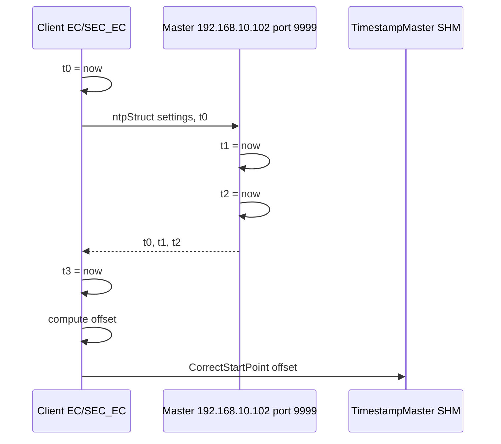

# timestamp_mw

Synchronizacja zegarów między komputerami (tinyNTP po TCP).

## TL;DR

Na masterze (`192.168.10.102`) nasłuchuje port 9999. Klienci co 4 s wysyłają t0, dostają ostemplowaną odpowiedź i wołają `TimestampMaster::CorrectStartPoint(offset)`. Aplikacje potem czytają już skorygowany czas przez `core/timestamp` (SHM).

## Opis funkcjonalności

Rola wynika z IP w `/srp/opt/cpu_srp/logger_config.json` (`"ip"`):

- **Master** — wypełnia `t1`/`t2` w callbacku RX.
- **Client** — wątek: wyślij `t0`, odbierz ramkę, licz offset i RTT.

Wzory:

- offset = `((T1 − T0) + (T2 − T3)) / 2`
- RTT = `(T3 − T0) − (T2 − T1)`

`Run()` serwisu tylko czeka na stop token — NTP działa w kontrolerze.

## Architektura

Brak IPC MW i braku SOME/IP. To nie jest klient dla aplikacji — aplikacje używają `TimestampController`.

## Protokół TCP

| Stała | Wartość |
|-------|---------|
| IP mastera | `192.168.10.102` |
| Port RX (listen master) | 9999 |
| Port TX | 9998 |
| Okres sync | 4000 ms |

Ramka `ntpStruct`: `settings:u8`, `t0…t3:int64`.

## Konfiguracja

- `deployment/mw/timestamp_mw/app_config.json` (FG: Platform, MW, Running, SafetyMode)
- IP z logger JSON, nie z pakietu MW

## Diagnostyka

Brak DID.

## Zależności

`//core/timestamp:timestamp_controller`, `StreamTCPSocket`.

## BUILD

| Target | Rodzaj |
|--------|--------|
| `//mw/timestamp_mw/service:timestamp_mw` | binary |
| `//mw/timestamp_mw/ntp/controller:ntp_controller` | lib |
| `//deployment/mw/timestamp_mw:timestamp_service` | adaptive_application |
